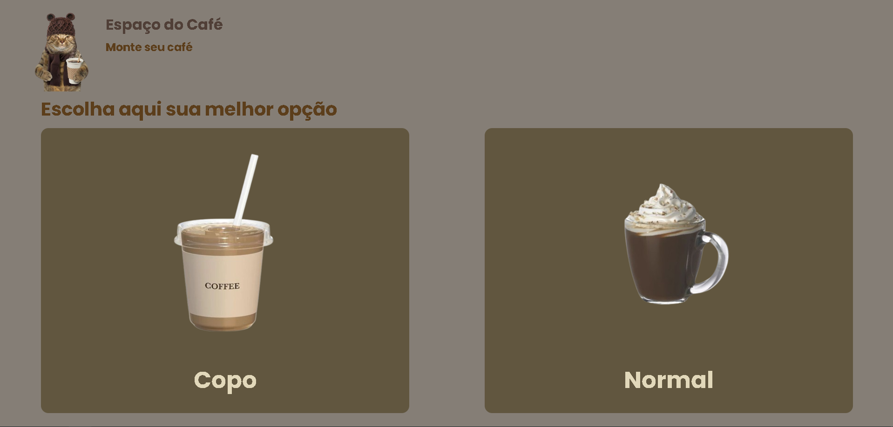
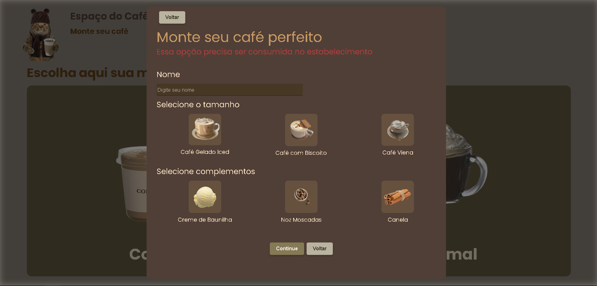

<h1>a simple coffee order page</h1>

<h2>did this for the iTalents bootcamp, built it with "vanilla JavaScript" its funny, I kinda love modals, sooo... I tried to make this work</h2>

<h3>It's not super pretty right now because it's missing responsiveness and it's not fully complete, but I promise I'll add that soon. The main goal was to use some JavaScript methods, and I built it with vanilla/pure HTML and CSS to work with the DOM, It's okay: I could have used another language or framework, but it was an assignment module for reviewing JavaScript</h3>

<h1>uma simples página de pedido de café</h1>

<h2>eu fiz para o bootcamp do Italents, eu fiz usando o javacript puro/vanilla, eu gosto muito de modals, então... Eu tentei fazer isso funcionar</h2>

<h3>não tá tão bonito por enquanto por que está falando a resposividade e não tá completo mas eu prometo que vou trabalhar nisso no futuro. Na verdade, O principal intuito era usar alguns métodos do JavaScript mas eu coloquei o HTML e CSS PUROS por que eu queria usar o DOM, tudo bem, eu poderia usar qualquer outra linguagem ou framework mas é uma entrega de revisão de um módulo de revisão de JavaScript<h3>
